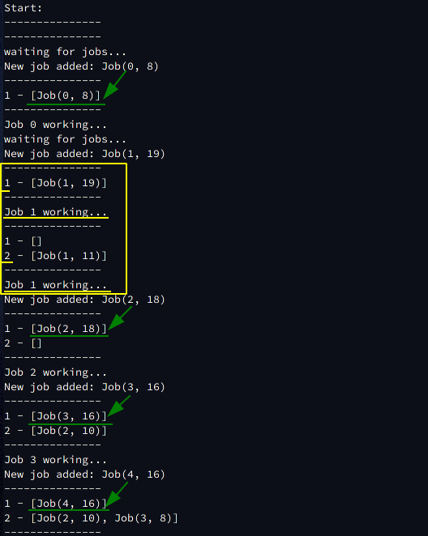

# Система обслуговування заявок при обмежених ресурсах
Implemented in `Rust`.

Алгоритм: MFQS (Multilevel Feedback Queue Sheduling).

## Загальний принцип роботи
Даний алгоритм є одним із найоптимальніших та поєднує в собі різні інші алгоритми пранування такі як
* FIFO
* SJF
* Приорітетна черга
* Round Robin
* Багаторівнева черга

Усі задачі, які пришли на виконання, розподіленці по чергах (FIFO). Кожна черга має свій власний пріоритет, який номеруються від 1 (1, 2, 3, ...). Спочатку виконуються усі задачі із черги із найменшим пріоритетом. Тільки якщо черга із приорітетом 1 пуста, ми виконуємо задачі із черги із пріоритетом 2. І так далі.

Коли додається нова задача, тоді вона потрапляє в чергу із приорітетом 1. Тобто в найбільш приорітетну чергу. Наший менеджер кожній зарачі із 1 черги дає один квант часу на роботу (8 мс). Якщо за цей час задача не встигла виконатися, тоді вона переміщується в наступну менш приорітетну чергу.
Якщо задач в черзі 1 більш не залишилося, тоді починається виконання черги 2. Так само, кожній задачі із цієї черги надається час роботи 16 мс. Якщо за цей час вони теж не встигли виконатися, тоді задача переміщується до черги 3. І так далі.

Цей підхід є оптимальним, але має один недолік: можливі випадки, коли якась задача потрапила у низькоприорітетну чергу і не може дочекатися, коли їй виділять процесорний час. Одним із способів вирішення є періодичне переміщення задач із низькоприорітетних черг у високоприорітетні.

## Приклад роботи

Кожна задача позначаєься як `Job(x, y)`, де `x` - id задачі (просто якесь число, щоб можна було ідентифікувати задачу), а `y` - час, який потрібен їй для завершення.

Зеленими стрілками та лініями показано як кожна нова задача потріпляє до найбільш пріорітетної черги. Жовтим кольором обведений випадок, коли певна задача не встигла виконатися за перший вкант часі і перейшла в чергу із приорітетом 2.
