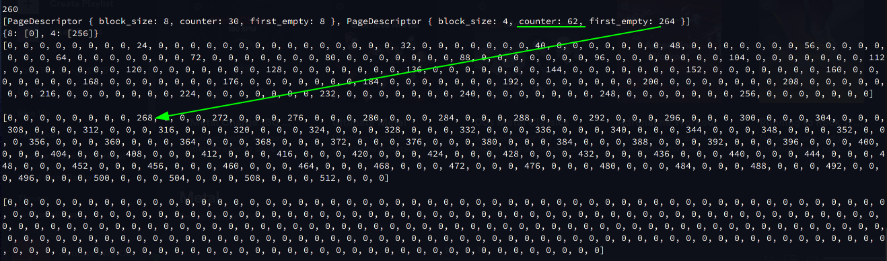

# Page Allocator
Implemented in `Rust`.

## Загальний принцип роботи

Вся пам'ять, яка доступна аллокатору, розділена на сторінки. Розмір сторінки може бути від 4Кбт до декількох мегабайт. Всі сторінки мають однаковий розмір.

Кожна сторінка поділена на блоки фіксованого розміру. Із самого початку роботи аллокатора, ніяка із сторінок не розмічена (розбита) на блоки. Форматування сторінки робиться під час роботи програми. Це пов'язано із тим, що ми не можемо знати на перед як саме розмісувати сторінки і блоки яких розмірів будуть найчатіше використовуватися.

Всі блоки поділяються на два типи:
1. розміром мерше ніж половина сторінки
2. розміром більше половини сторінки

Кожна сторінка може бути тільки в трьох станах: розділена на блоки, зайнята багатосторінковим блоком, та вільна.

Аллокатор збегірає наступні дані про сторінки:
* дескриптор ("descriptor", "описатель") існує для кожної розміченгої сторінки. Один дескриптор включає в себе вказівник на перший вільний блок на сторінці та кількість вільних блоків. У своїй реалізації я також включав розмір блоку сторінки. Всі дескриптори я зберігав у масиві.
* масив (або хешмапак) із списками сторінок, в яких є як мінімум один вільний блок.

Детальніше про останній пункт. Я використовував варінат із хешмапою в якої ключем є розмір блоку, а значенням список із сторінок, в яких є як мінімум один вільний блок. Це означає, що сторінки, усі блоки яких зайняті, в цей список не попадуть. При виділенні пам'яті, ми повинні дивитися чи не стала в результаті заповнена на максимум сторінки і чи не потрібно її видалити із списку. При звільненні пам'яті потріно також перевіряти чи не потрібно сторінку додати до списку.

На самій сторінці всі вільні блоки утворюють список. Тобто, якщо блок вільний, то ми можемо записати в нього адресу на наступний вільний блок, і це нікому не помішає, бо цей блок вільний. Дескриптор зберагіє вказівник на перший вильний блок. Коли ми віддаємо якись блок на роботу, то дескриптор просто запам'ятовує наспуний блок із списку. Коли ми очищуємо якийсь блок, то той блок дописується в початок списку, а дескриптор починає вказувати на нього.

# Alloc

Спочатку розмір запрошуваної пам'яті `size` потрібно округлити:
* до першого більшого розміру блоку, якщо `size` менше половини сторінки
* до цільї кількості сторінок, якщо `size` більше ніж пів сторінки

Якщо перший випадок:
Після цього ми шукаємо в нашій хешмапі сторінку, в якій є вільне місце. Оскільки в якості значення в хешмапі зберігаєтються сторінки із вільними блоками, то ми можемо просто взяти першу із того списку. Якщо її не має, то ми беремо не розмічену сторінку та розмічуємо її блоками потрібного розміру (незабуваючи створити для неї новий дескриптор) та додаємо в хешпаму. Після того, як вибрали сторінку, із її дескриптора запам'ятовуєть сяокремо адреса першого вільного блоку (ця адреса повернеться користувачеві) та зменшується лічильник вільних блоків на -1. Після цього оновляємо вказівник на перший вільний блок в дескрипторі. Якщо вільних блоків на сторінці більш не має (це можна по лічильний глянути легко), тоді ми видаляємо цю сторінку із хешмапи.

Якщо другий випадок:
Дивимося чи в хешмапі є вільні сторінки. Якщо є, то беремо їх. Якщо ні, то беремо стільки вільних сторінок, скільки треба, створюємо дескриптор для кожної з них. В першому дескрипторі вказуємо повний розмір блоку (тобто розмір цих декількох сторінок рязом узятих). Решта дескрипторів просто для кількості. Користувачеві повертаємо вказівник на початок першої сторінки із взятих.

# Dealloc

По переданому вказівникові визначаємо номер сторінки. Маючи номер, шукаємо дескриптор сторінки. По дескриптору ми можемо побачити, якільки пам'яті займає блок, який потрібно видалити. Тут 2 випадки
* очищуємо блок із розміром менше половини сторінки
* очищуємо блок із розміром на декілька сторінок

Якщо перший випадок:
В дескрипторі сторінки ми збільшуємо лічильник на +1 та оновлюємо вказівник на перший вільний блок (ним тепер буде видалений блок). Якщо сторінка перед видаленням була повна (без вільних блоків), то тоді ми її повинні занести в хешмапу.

Якщо другий випадок:
Очищуємо хеадер дескриптора торінки. Добавляємо даний блок (сторінки) в хешмапу.

# Приклад роботи програми
У свій приклад я включив виділення та видалення блоків пам'яті, які є меншими за пів сторінки та більшими за пів сторінки.
Щоб було зручно візуалізувати роботи аллокатора, я використовую всього тільки 3 сторінки. В рельному аллокаторі їх значно більше.
Код тестування:
```rust
println!("{}", allocator.alloc(6));
allocator.dump();

println!("{}", allocator.alloc(5));
allocator.dump();

println!("{}", allocator.alloc(5));
allocator.dump();

allocator.dealloc(8);
allocator.dump();

println!("{}", allocator.alloc(3));
allocator.dump();

println!("{}", allocator.alloc(4));
allocator.dump();

println!("{}", allocator.alloc(200));
allocator.dump();

allocator.dealloc(512);
allocator.dump();
```

Фукція `allocator.dump();` виводить на екран стан аллокатора (дані хештаблиці, дескрипторів та сторінок).

Із самого початку ніяка із торінок не розмічена. Після першого виділення пам'яті ми розмітимо нову сторінку блоками по 8 байт (буде блок на 8, бо що аллокатор вирівняє 6 до 8). До цієї сторінки буде створено новий дескриптор. В ньому кількість вільних блоків буде менше на один за максимальну (бо ми один відразу віддаємо користувачеві) і вказівник на перший вільний блок вказуватиме на другий блок (див стрілочку на фото). Також ця сторінка кладеться в хешмапу, бо вона має вільні блоки.

Пілся другого виділення в тій самій сторінці, бо 5 заокруглиться до 8 і є вільні блоки, вказівник на перший вільний блок вказуватиме на другий, а counter зменшиться на 1.

Аналогічно із третім виділенням.

Далі ми видаляємо другий блок (його адреса 8. див код вище). Очевидно, що counter збільшиться на 1 (бо ми звільнили один блок). Тепер вказівник на перший вільний блок вказуватиме на другий (див стрілочку на фото), а в самому блоці буде записане значення на наступний вільний блок.

Далі ми проводимо пару алокацій, тільки для сторінки із розміром блоку в 4 байти. Просто щоб показати, що аллокатор працює для різних аллокацій. Бачимо, що ця сторінка також додалася в хешмапу. Перше виділення пам'яті:

Друге виділення пам'яті:

Тепер ми просимо аллокатора виділити пам'яті більше ніж пів сторінки. Розмір заокруглиться до цілої сторінки. Бачимо, що створився новий дескриптор. Там бачимо розмір та те, що вільних блоків не має. Сама сторінка не розмічається, бо це багатосторінковий (в даному випадку односторінковий) блок. В хеш мапу сторінка теж не заноситься, бо в ній не має вільного місця. Вона зайнята повністю.

Тепер видаляємо цей великий блок. В дескрипторі він позначився як пустий. Також чи занесли його в хешмапу. Якщо нам треба буде знову такий великий кусок пам'яті, то саме цю сторінку ми візьмемо.

