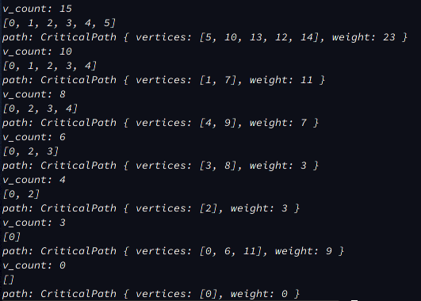

# Дослідження принципів проектування та роботи динамічного та статичного планування

## Короткі теоретичні відомості

Основною метою цієї лабораторної роботи (саме мого варіанту) є:
* скласти програму для побудови базового розв'язку для зваженого ациклічного графа (з пересилками). Та визначити час рішення.

Для початку розберемося що собою цей граф представлє, що в нього є вершинами, ребрами, вагами вершин та ребер.

В нас є деяка NP-повна задача, яку потрібно вирішити. При знятті обмеження на кількість процесорів, а також при двох процесорах, завдання має точне рішення за поліноміальний час. Тобто ми маємо певний комп'ютерний ресурс (набір процесорів) і ми маємо розпланувати їх роботу над нашою задачею так, щоб це було оптимально.
Ми задачу розбиваємо на підзадачі та будуємо із них направлений ациклічний граф. У вершинах графа росташовані наші підзадачі, де записано час, який потрібний на виконання підзадачі. Усі вершини з'єднані направленими ребрами. Кожне ребро має вагу - комунікаційні витрати - це є час, необхідний для переміщення даних із однієї вершини в іншу. Варто звернути увагу на те, що побудований граф повинен не мати циклів (бути ациклічним, як написано вище).

Вага рівня - сума ваги усіх вершин, що знаходяться на даному рівні.щ

Шлях - множина вершин, що входять в усі рівні графу, включаючи перший та останній рівень.

Критичний шлях - максимальний за вагою шлях (сума переходів між вершинами максимальна із усіх можливих для заданого графа).

В загальному, завданням цієї лабораторної роботи є: `Маючи граф підзадач G(n), скласти розклад S(n, y) на P(y) процесорах`.

## Загальний принцим роботи

Пошук оптимізованого плану завантаження виконується в декілька етапів. Першим етапом є виконання операцій пов'язаних з визначенням критичного шляху (шляхів) і завантаження вершин, що входять в критичний шлях.

Вершини, що входять до критичного шляху, завантажеються на один прицесор.

Виконння завантаження цих вершин на один процесор виконується шляхом їх кластеризації. При цьому, комунікаційні витрати між цими вершинами не враховуються, тобто відповідні вершини графа занулюються. Потім граф редукується наступний етап графу виконується для нового суграфу.
У кожному графі є як мінімум один критичний шлях.

Після того як ми визначили критичний шлях і вершини, які входять до нього, ми редукуємо граф, видаляючи із графу ці вершини, а задачі, що відповідають цим вершинам завантажеємо на один процесор.

На результуючому графі ми шукаємо новий критичний шлях і завантажуємо їх на процесор.

## Приклад роботи алгоритму планування

`v_count` - кількість вершин в графі, які залишилися на початок певної ітерації.

`path` - знайдений критичний шлях для графа. `path` включає в себе масив чисел `vertices`, тобто послідовність вершин, які входять до цього шляху, та `weight` - загальний час виконання цього шляху. В завданні до латораторної роботи сказано із пересилками, тобто я до `weight` критичного шляху маю враховувати ваги ребер (час пересилок).

## Література
* [Книга "Системне програмне забезпечення"](https://comsys.kpi.ua/katalog/files/metodichni-vkazivki-kursovogo-proektu-spz.pdf)
